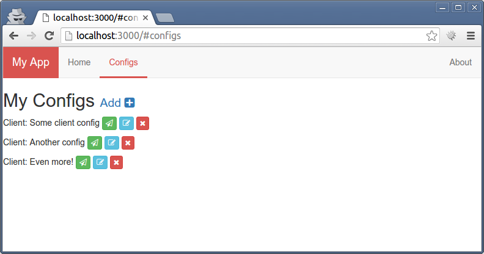

Playing with Marionette JS
--------------------------
This is a base localStorage CRUD test using Marionette JS, Babel and Gulp.

CSS and chunks of the configs were taken from the [marionette-wires](https://github.com/thejameskyle/marionette-wires) example.

It uses [Backbone.localStorage](https://github.com/jeromegn/Backbone.localStorage) to persist the collection.

[Demo](http://cristianszwarc.github.io/marionetteCRUD/)

**Use**
node install
bower install
gulp

**Screenshot**

**License**
MIT
